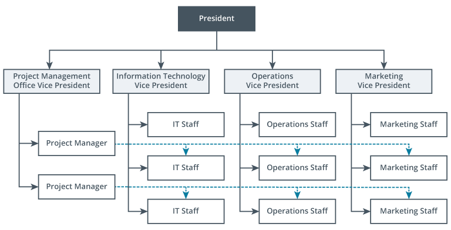

And [Organizational Structure](Organizational%20Structures.md) that includes functional leaders and specialized roles, while also including project managers.  When a project forms, team members from the functional areas work on the project teams, either part-time or full-time.

