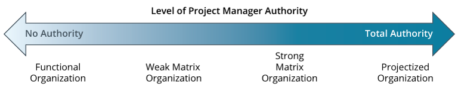

Three main types of organization structures:

1. [Functional Organization](notes/Functional%20Organization.md)
2. [Projectized Organization](notes/Projectized%20Organization)
3. [Matrix Organization](notes/Matrix%20Organization)

Project managers have no power in a functional org, while they have all the power in a projectized org.  Matrix orgs fall in the middle and can vary based on whether it's a strong matrix or a weak matrix.

