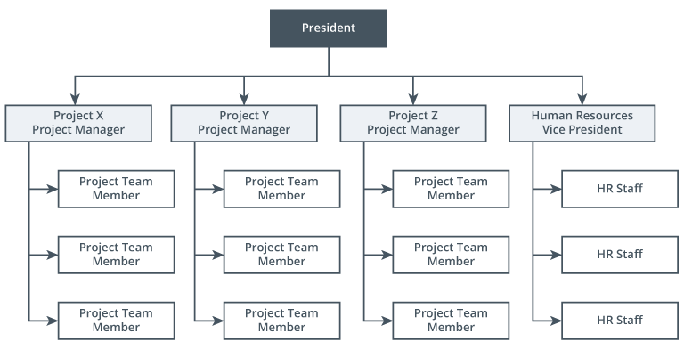

An [Organizational Structure](Organizational%20Structures.md) that pools resources around projects. A project manager leads a group of people as long as a project exists. Once the project is completed, the team disbands and forms around a new project.

